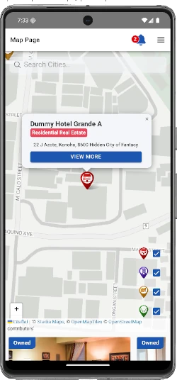
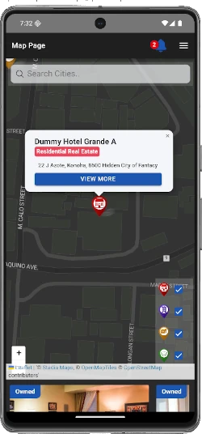
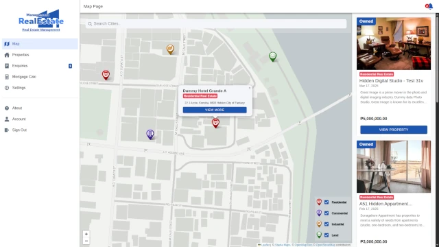
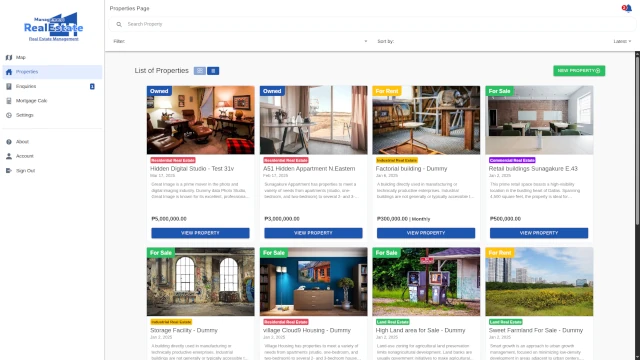
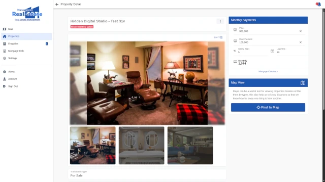
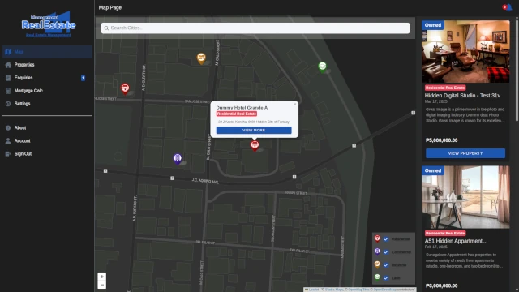
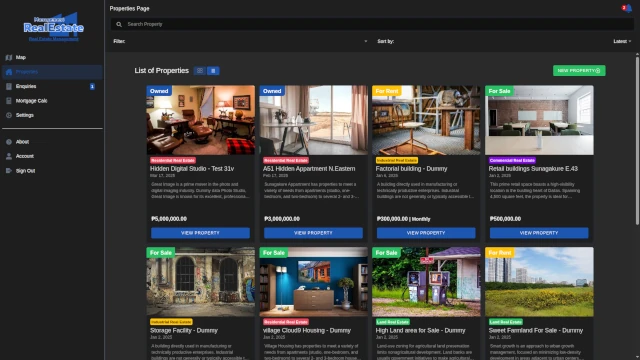
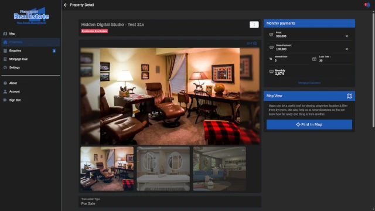

[](https://github.com/eevan7a9/real-estate-management/stargazers)
[](LICENSE)

# real-estate-management

A web and mobile property management solution built with Ionic, Angular and Nodejs Fastify.
Designed for managing residential, commercial, and land properties the app allows users to explore available estates via an interactive map and directly send inquiries to property owners.

🚧 **frontend/** work in progress 🚧.

🚧 **backend-fastify/** work in progress 🚧.

### **[LIVE WEB PREVIEW](https://real-estate-management.netlify.app/)**

# 🎨 Themes

## 📱 Android (Pixel 7)

<p float="left">
  
  
</p>

## 💻 Desktop Browser

### ☀️ Light Theme

<p float="left">
  
  
  
</p>

### 🌙 Dark Theme

<p float="left">
  
  
  
</p>

# **🗃️ Dependencies**

### **Frontend**

- [Ionic 9+](https://ionicframework.com/)
- [Angular 20+](https://angular.io/)
- [tailwindcss 4+](https://tailwindcss.com/)
- [leaflet 1.7+](https://leafletjs.com/)
- [chartjs 4+](https://www.chartjs.org/)

### **Backend**

- [Node](https://nodejs.org/en/)
- [fastify 4+](https://www.fastify.io/)
- [mongoDB](https://www.mongodb.com/)

# **🧑‍💻 SETUP**

## **Frontend web setup**

### **1.1 navigate to `frontend/` directory.**

```
#  navigate to frontend
$ cd frontend
```

### **1.2 Configure environment variables**

Copy the frontend template to a local `.env` file:

```bash
cp .env.example .env
```

For a production build, create a separate production configuration:

```bash
cp .env.example .env.production
```

Required values:

```env
API_SERVER=http://localhost:8000/
WEBSOCKET_URL=ws://localhost:8000/websocket
```

Optional browser-visible values include:

```env
GOOGLE_AUTH_CLIENT_ID=

MAP_KEY=
MAP_TILES_DEFAULT=https://tile.openstreetmap.org/{z}/{x}/{y}.png
MAP_TILES_DARK=https://tile.openstreetmap.org/{z}/{x}/{y}.png

RESTRICTED_MODE=false
RESTRICTED_HEADING=Restricted
RESTRICTED_MESSAGE=This feature is currently disabled in this mode.
```

`.env` and `.env.production` are ignored by Git. Do not put server secrets in them: their values are compiled into the browser application.

### **2. Install dependencies**

```bash
npm install
```

### **3. Run the frontend**

```bash
ionic serve
```

`ionic serve` reads `.env` and generates `src/environments/environment.generated.ts` before starting Angular. After changing `.env`, stop and start `ionic serve` again.

### **4. Build the frontend**

```bash
# Development build using .env
npm run build:development

# Production build using .env.production
npm run build
```

All frontend environment values are browser-visible at runtime. Keep credentials and other secrets on the backend.

Tailwindcss Build Styles

```
# Build to Generate styles
$ npm run tailwind:build

# Build to Generate styles & Watch
$ npm run tailwind:watch
```

## **📱 Android setup**

sync any chages from web to android:

```
npx cap sync android
```

If Android is not available **(Optional)**

```
npx cap add android
```

run to open Android Studio

```
npx cap open android
```

To run the project on Emulator or Device **(Alternative)**

```
npx cap run android
```

<br>

## **Backend-Fastify setup**

### **1.1 navigate to `backend-fastify/` directory.**

```
cd backend-fastify/
```

### **1.2 create `.env` file & add variables:**

- copy `.env.example` & re-name it to `.env`
- set your desired variable value

```
PORT=8000
LOGGER=true
SALT=12
SECRET_KEY='secret'
DB_CONNECT=mongodb://localhost:27017/rem-db
```

### **2. then install dependencies & run dev**

In terminal - command

```
#  navigate to backend-fastify
$ cd backend-fastify

# install dependencies
$ npm install

# start server
$ npm start `or` $ npm run dev

```

### **2.1 Database seeder(optional)**

- Make sure `.env` is configured & dependencies are installed
- Will populate database with dummy data.

⚠️ This will delete existing records in the database document.

⚠️ Make a backup if needed

```
$ npm run db:seeder
```

dummy user:

```
  fullName: "test tester",
  email: "test@email.com",
  password: "password"

  You can use this to signin.
```

## Routes

```
/docs/
/users/
/auth/
/properties/
/enquiries/
```

## Running with Docker

### Prerequisites
- Docker
- Docker Compose

### Steps

1. Clone the repo
2. Run:
   docker-compose up --build

3. Open:
   Frontend: http://localhost:8100
   Backend: http://localhost:8000